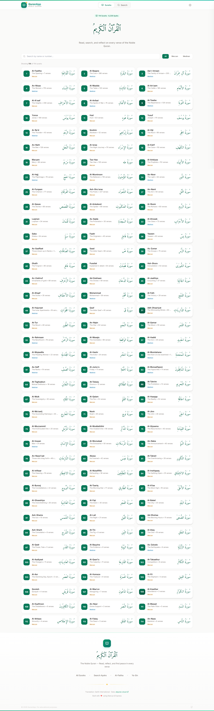
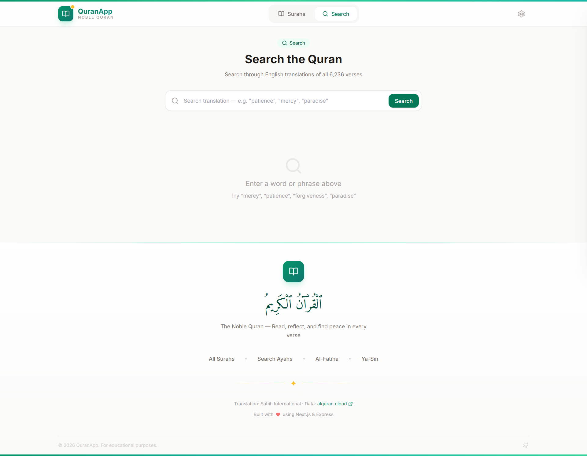
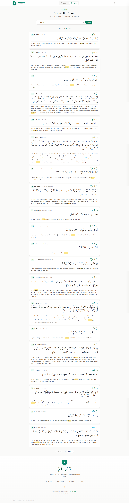
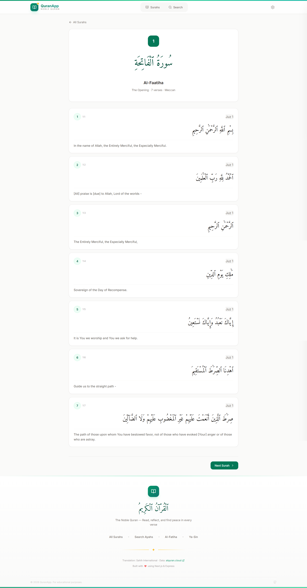
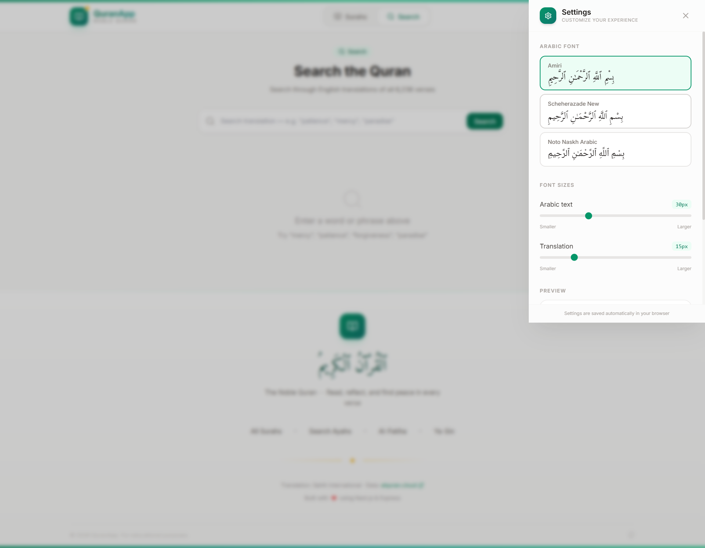

# 📖 Al-Quran Full-Stack Application

**Live Demo: [al-quran-task.netlify.app](https://al-quran-task.netlify.app/)**

A modern, high-performance Quran application built with **Next.js 14**, **Node.js/Express**, and **SQLite**. This project provides a clean interface to read the Holy Quran, search for ayahs, and learn about different Surahs.

---

## ✨ Features

- **📖 Surah Exploration**: Browse all 114 Surahs with detailed information including Arabic names, transliteration, and English meanings.
- **🔍 Advanced Search**: Fast and efficient search across the entire Quran text using SQLite's optimized querying.
- **⚡ Performance**: Built on Next.js 14 with server-side rendering (SSR) and a lightweight Express.js backend.
- **🛡️ Security**: Backend equipped with Helmet.js for secure headers, Rate Limiting to prevent abuse, and CORS configuration.
- **📱 Responsive Design**: Fully responsive UI built with Tailwind CSS, ensuring a premium experience on mobile, tablet, and desktop.
- **🌑 Dark Mode Support**: Sleek and modern aesthetics with a focus on readability.

---

## 🏗️ Project Structure

The project is organized as a monorepo:

### 📁 `backend/`
The API server powered by Express.js.
- **Database**: SQLite3 (`quran.db`) for lightweight and fast data retrieval.
- **Architecture**: Controller-Route-Service pattern.
- **Security**: Includes Helmet, Morgan for logging, and express-rate-limit.

### 📁 `frontend/`
The web application powered by Next.js.
- **Styling**: Tailwind CSS for modern, utility-first design.
- **Components**: Lucide-React for clean iconography.
- **App Router**: Optimized routing and data fetching.

---

## 🚀 Getting Started

### Prerequisites
- Node.js (v18 or higher)
- npm or yarn

### 1. Database Setup
The backend uses a SQLite database. To initialize it:
```bash
cd backend
npm install
npm run seed  # Loads the Quran data into quran.db
```

### 2. Run the Backend
```bash
cd backend
npm run dev
```
The API will be available at `http://localhost:5000` (Local Development).

### 3. Run the Frontend
```bash
cd frontend
npm install
npm run dev
```
The application will be available at `http://localhost:3000` (Local Development).

---

## 🔌 API Documentation

### **Surahs**
- `GET /api/surahs`: List all 114 Surahs.
- `GET /api/surahs/:id`: Get a specific Surah with all its Ayahs (Arabic & English translation).

### **Search**
- `GET /api/search?q=query`: Search for specific keywords in the Quran text.

### **Health Check**
- `GET /api/health`: Verify the server status.

---

## 🌐 Deployment

### Frontend (Netlify)
The project is configured for easy deployment to Netlify using the `netlify.toml` file.

**Deployment Steps:**
1. Connect your GitHub repository to Netlify.
2. Set the **Base Directory** to `frontend`.
3. Set the **Build Command** to `npm run build`.
4. Set the **Publish Directory** to `.next`.

### Backend
For the backend, it is recommended to use **[Render.com](https://render.com)** or **Railway.app** which support persistent storage for the `quran.db` file.

---

## 🛠️ Built With

- **Frontend**: [Next.js](https://nextjs.org/), [React](https://reactjs.org/), [Tailwind CSS](https://tailwindcss.com/)
- **Backend**: [Express.js](https://expressjs.com/), [Better-SQLite3](https://github.com/WiseLibs/better-sqlite3)
- **Icons**: [Lucide React](https://lucide.dev/)

---

## 📸 Screenshots

<div align="center">
  
  
  
  
  
</div>
